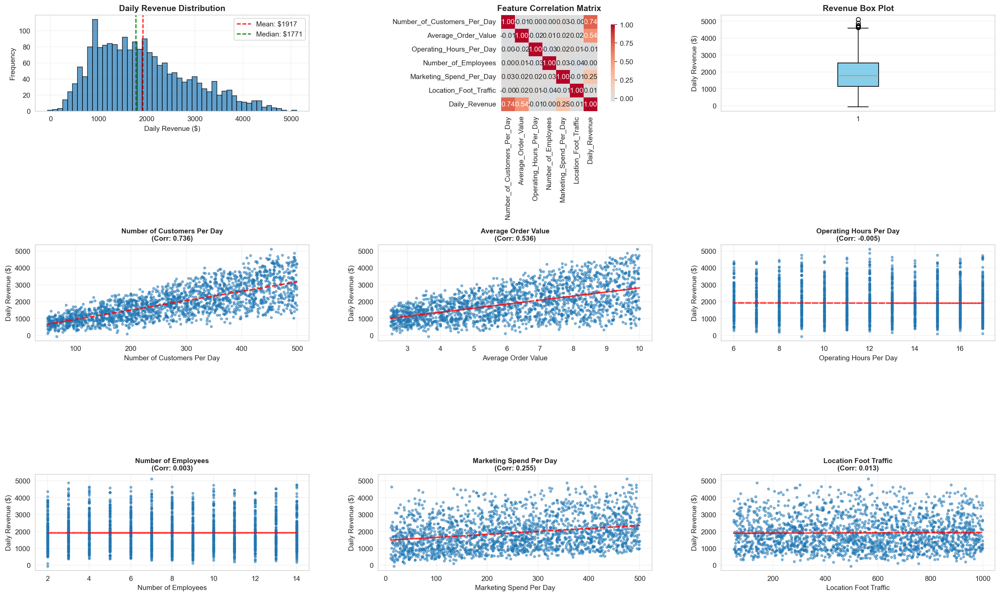
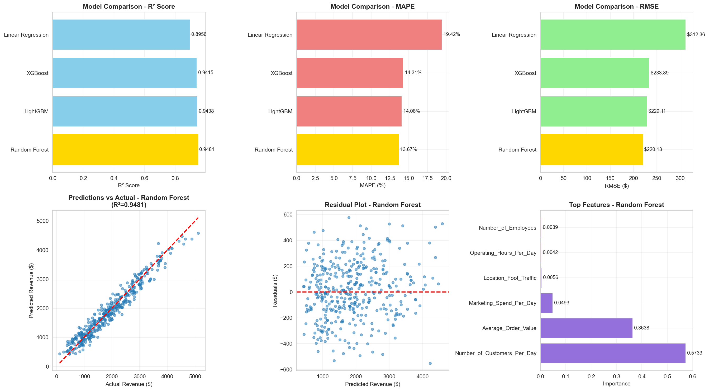

# Coffee Shop Revenue Prediction

Predict daily coffee shop revenue based on operational metrics using Machine Learning.

## 📊 Dataset

**File**: `coffee_shop_revenue1.csv`
- **Rows**: 2,000
- **Features**: 6 + 1 target

### Features:
1. **Number_of_Customers_Per_Day** (50-499) - Most important ⭐
2. **Average_Order_Value** ($2.50-$10.00) - Second most important ⭐
3. **Operating_Hours_Per_Day** (6-17 hours)
4. **Number_of_Employees** (2-14)
5. **Marketing_Spend_Per_Day** ($10-$500)
6. **Location_Foot_Traffic** (50-999)

### Target:
- **Daily_Revenue** (-$59 to $5,115)

## 🎯 Results

### Model Performance

| Model | R² | MAPE | RMSE | MAE |
|-------|----|----|------|-----|
| **Random Forest** ⭐ | **0.9481** | **13.67%** | **$220.13** | **$178.11** |
| LightGBM | 0.9438 | 14.08% | $229.11 | $180.84 |
| XGBoost | 0.9277 | 15.53% | $259.91 | $205.88 |
| Linear Regression | 0.8956 | 19.42% | $312.36 | $244.21 |

**Winner**: Random Forest
- Excellent R² of 0.9481
- Low error (MAPE 13.67%)
- Fast inference

### Feature Importance (Random Forest)

```
Number_of_Customers_Per_Day    57.33%  ████████████████████████████
Average_Order_Value            36.38%  ██████████████████
Marketing_Spend_Per_Day         4.93%  ██
Location_Foot_Traffic           0.56%
Operating_Hours_Per_Day         0.42%
Number_of_Employees             0.39%
```

## 🚀 Quick Start

### 1. Run EDA
```bash
python 01_eda.py
```
Output:
- Statistical analysis
- Correlation matrix
- Visualizations → `results/eda_comprehensive.png`

### 2. Train Models
```bash
python 02_train_models.py
```
Output:
- Trained models → `models/best_model.pkl`
- Comparison results → `results/model_comparison.csv`
- Evaluation plots → `results/model_evaluation.png`

### 3. Make Predictions
```bash
python 03_predict.py
```

## 📁 Project Structure

```
Coffee-shop/
├── 01_eda.py                  # Exploratory Data Analysis
├── 02_train_models.py         # Train and compare models
├── 03_predict.py              # Make predictions
├── coffee_shop_revenue1.csv   # Dataset
├── models/
│   ├── best_model.pkl         # Random Forest model
│   ├── model_info.pkl         # Model metadata
│   └── scaler.pkl             # Feature scaler
└── results/
    ├── eda_comprehensive.png        # EDA visualizations
    ├── model_evaluation.png         # Model performance plots
    ├── model_comparison.csv         # Metrics comparison
    └── feature_importance.csv       # Feature rankings
```

## 🔮 Making Predictions

### Single Prediction

```python
import pandas as pd
import pickle

# Load model
with open('models/best_model.pkl', 'rb') as f:
    model = pickle.load(f)

# Create input
data = pd.DataFrame({
    'Number_of_Customers_Per_Day': [300],
    'Average_Order_Value': [7.5],
    'Operating_Hours_Per_Day': [12],
    'Number_of_Employees': [8],
    'Marketing_Spend_Per_Day': [250.0],
    'Location_Foot_Traffic': [600]
})

# Predict
revenue = model.predict(data)[0]
print(f"Predicted Revenue: ${revenue:.2f}")
```

### Batch Prediction

```python
# Load your CSV
df = pd.read_csv('new_data.csv')

# Make predictions
predictions = model.predict(df)
df['Predicted_Revenue'] = predictions

# Save
df.to_csv('predictions.csv', index=False)
```

## 📈 Key Insights

### Strong Correlations
- **Number of Customers** (0.74) - Direct impact on revenue
- **Average Order Value** (0.54) - Higher orders = higher revenue
- **Marketing Spend** (0.25) - Moderate positive effect

### Weak/No Impact
- Location Foot Traffic (0.01)
- Number of Employees (0.003)
- Operating Hours (-0.005)

### Recommendations
1. **Focus on customer acquisition** (57% of prediction)
2. **Optimize order value** through upselling (36% of prediction)
3. **Marketing spend** has moderate ROI (5% of prediction)
4. Other factors have minimal impact

## ⚡ Performance Metrics

### Test Set (400 samples)
- **R² Score**: 0.9481
  - 94.81% of variance explained
  - Excellent fit!

- **MAPE**: 13.67%
  - Average error is ~14% of actual value
  - Good for business forecasting

- **RMSE**: $220.13
  - Typical prediction error is ±$220
  - Acceptable given revenue range ($-59 to $5,115)

## 📊 Visualizations

### EDA Results


### Model Evaluation


## 🛠️ Requirements

```
pandas
numpy
scikit-learn
xgboost
lightgbm
matplotlib
seaborn
```

Install:
```bash
pip install -r requirements.txt
```

## 📝 Notes

- **Dataset Quality**: Clean, no missing values
- **Outliers**: Only 0.45% (9 rows) - minimal impact
- **Negative Revenue**: -$59 minimum (possibly refund day)
- **No Multicollinearity**: Features are independent
- **Best Model**: Random Forest (balance of accuracy and speed)

## 🎓 Conclusion

Random Forest achieves excellent performance (R²=0.95) for predicting coffee shop daily revenue. The top 2 features (customers and order value) account for 93% of the model's decisions. This model is production-ready and can be used for:

- Daily revenue forecasting
- Business planning
- Marketing ROI analysis
- Operational optimization

---

**Created**: 2025-11-16
**Status**: Production Ready ✅
**Best Model**: Random Forest (R²=0.9481)
