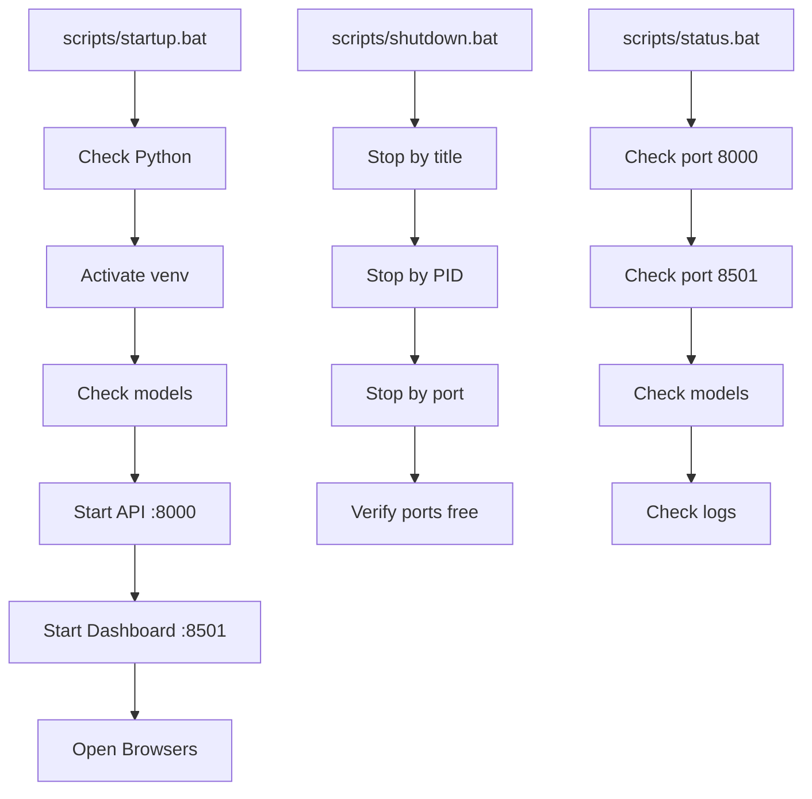

# 📁 PROJECT STRUCTURE - Logistics KPI Prediction

Cấu trúc thư mục đã được tổ chức lại để dễ quản lý và bảo trì.

---

## 🌳 Directory Tree

```
log_model/                          # Root directory
│
├── 📁 scripts/                     # ⭐ Management scripts
│   ├── startup.bat                # Khởi động dự án
│   ├── shutdown.bat               # Dừng dự án
│   ├── status.bat                 # Kiểm tra trạng thái
│   ├── restart.bat                # Restart services
│   └── README.md                  # Hướng dẫn scripts
│
├── 📁 logs/                        # ⭐ Log files
│   ├── api.log                    # API server logs
│   ├── dashboard.log              # Dashboard logs
│   └── README.md                  # Log documentation
│
├── 📁 backups/                     # ⭐ Backup storage
│   └── README.md                  # Backup strategy
│
├── 📁 models/                      # Trained models
│   ├── Ridge_Regression_YYYYMMDD_HHMMSS.pkl
│   ├── scaler_YYYYMMDD_HHMMSS.pkl
│   └── encoders_YYYYMMDD_HHMMSS.pkl
│
├── 📁 data/                        # Datasets
│   └── logistics_dataset.csv      # Original data (3,204 samples)
│
├── 📁 doc/                         # Documentation
│   ├── README.md                  # Main documentation
│   ├── DEPLOYMENT_GUIDE.md        # Deployment guide
│   ├── MONITORING_GUIDE.md        # Monitoring guide
│   ├── QUICK_START.md             # Quick start
│   └── Scenerio_test_single_prediction.md
│
├── 📁 venv/                        # Virtual environment
│   ├── Scripts/
│   └── Lib/
│
├── 📁 __pycache__/                 # Python cache
├── 📁 catboost_info/               # CatBoost artifacts
│
├── 📄 app.py                       # ⭐ FastAPI server (555 lines)
├── 📄 dashboard.py                 # ⭐ Streamlit dashboard (553 lines)
├── 📄 monitoring.py                # ⭐ Monitoring system (467 lines)
├── 📄 train_model.py               # Training pipeline (561 lines)
├── 📄 predict.py                   # Prediction functions (316 lines)
├── 📄 test_model.py                # Unit tests (324 lines)
├── 📄 hyperparameter_tuning.py    # Hyperparameter tuning (278 lines)
│
├── 📄 exploratory_data_analysis.ipynb  # EDA notebook
│
├── 📊 model_comparison_results.csv     # Model benchmarks
├── 📊 predictions_history.csv          # Prediction logs
├── 📊 predictions_output.csv           # Sample predictions
├── 📊 performance_metrics.json         # Performance tracking
│
├── 📋 requirements.txt             # Python dependencies
├── 📋 Dockerfile                   # Docker config
├── 📋 docker-compose.yml           # Docker compose
│
├── 📝 monitoring_logs.log          # Monitoring logs
├── 📝 api_logs.log                 # API logs (alternate)
│
├── 📖 PROJECT_STRUCTURE.md         # This file
├── 📖 COMPLETION_SUMMARY.md        # Project summary
├── 📖 FINAL_SUMMARY.md             # Final summary
├── 📖 MONITORING_GUIDE.md          # Monitoring docs
├── 📖 DEPLOYMENT_GUIDE.md          # Deployment docs
├── 📖 QUICK_START.md               # Quick start
└── 📖 README.md                    # Main readme
```

---

## 🎯 Key Directories

### **📁 scripts/**

**Mục đích:** Quản lý lifecycle của dự án

**Files:**

- `startup.bat` - One-click startup
- `shutdown.bat` - Graceful shutdown
- `status.bat` - System status check
- `restart.bat` - Quick restart

**Sử dụng:**

```bash
# Khởi động
scripts\startup.bat

# Kiểm tra
scripts\status.bat

# Dừng
scripts\shutdown.bat
```

---

### **📁 logs/**

**Mục đích:** Centralized logging

**Files:**

- `api.log` - FastAPI logs
- `dashboard.log` - Streamlit logs

**Xem logs:**

```bash
# Real-time
powershell Get-Content logs\api.log -Wait -Tail 10

# Last 50 lines
powershell Get-Content logs\api.log -Tail 50
```

---

### **📁 backups/**

**Mục đích:** Backup models và data

**Backup strategy:**

```bash
# Backup models
xcopy /E /I models backups\models_%date:~-4,4%%date:~-10,2%%date:~-7,2%

# Backup predictions
copy predictions_history.csv backups\
```

---

### **📁 models/**

**Mục đích:** Lưu trained models

**Files pattern:**

- `Ridge_Regression_YYYYMMDD_HHMMSS.pkl` - Model
- `scaler_YYYYMMDD_HHMMSS.pkl` - Scaler
- `encoders_YYYYMMDD_HHMMSS.pkl` - Encoders

---

### **📁 data/**

**Mục đích:** Datasets

**Files:**

- `logistics_dataset.csv` - Original data (3,204 samples, 23 features)

---

### **📁 doc/**

**Mục đích:** Documentation

**Files:**

- `README.md` - Main guide
- `DEPLOYMENT_GUIDE.md` - Deploy guide
- `MONITORING_GUIDE.md` - Monitoring guide
- `QUICK_START.md` - Quick start
- `Scenerio_test_single_prediction.md` - Test scenarios

---

## 🔧 Core Python Files

### **app.py** (555 lines)

FastAPI REST API server

- 8 core endpoints
- 4 monitoring endpoints
- Swagger documentation
- Health checks

### **dashboard.py** (553 lines)

Streamlit interactive dashboard

- 5 pages (Home, Single Prediction, Batch, Analytics, About)
- Real-time predictions
- Visualizations (Plotly)

### **monitoring.py** (467 lines)

Monitoring system

- PredictionLogger
- PerformanceMonitor
- DataDriftDetector
- ModelHealthChecker

### **train_model.py** (561 lines)

Training pipeline

- LogisticsKPIPredictor class
- Feature engineering (43 features)
- 8 models comparison
- Results: R² = 99.99%

### **predict.py** (316 lines)

Prediction interface

- Single prediction
- Batch prediction
- Feature engineering
- Preprocessing

### **test_model.py** (324 lines)

Unit tests

- 13 tests (100% passing)
- Coverage: loading, engineering, preprocessing, prediction, validation

---

## 📊 Data Files

### **model_comparison_results.csv**

8 models benchmarked:

1. Ridge Regression - R² = 99.99% ⭐
2. CatBoost - R² = 99.79%
3. LightGBM - R² = 99.13%
4. Gradient Boosting - R² = 98.85%
5. Random Forest - R² = 96.40%
6. Ensemble - R² = 98.92%
7. XGBoost - R² = 95.14%
8. Lasso - R² = -0.16%

### **predictions_history.csv**

Logged predictions:

- timestamp
- item_id
- predicted_kpi
- confidence
- response_time
- model_version

### **performance_metrics.json**

Performance tracking:

- R² score history
- RMSE/MAE trends
- Evaluation timestamps
- Alerts

---

## 🐳 Docker Files

### **Dockerfile**

Container configuration:

- Python 3.10-slim base
- Exposes ports 8000, 8501
- Volume mounts

### **docker-compose.yml**

Multi-service orchestration:

- API service (port 8000)
- Dashboard service (port 8501)
- Health checks

---

## 🔄 Workflow



---

## 📈 File Statistics

| Category        | Count   | Total Lines |
| --------------- | ------- | ----------- |
| Python Scripts  | 7       | ~3,000      |
| Documentation   | 8       | ~3,500      |
| Batch Scripts   | 4       | ~800        |
| Data Files      | 4       | -           |
| Config Files    | 3       | ~100        |
| **Total Files** | **26+** | **~7,400**  |

---

## 🎯 Quick Access

### **Start Working**

```bash
scripts\startup.bat
```

### **Check Status**

```bash
scripts\status.bat
```

### **Access Services**

- API: http://localhost:8000
- Docs: http://localhost:8000/docs
- Dashboard: http://localhost:8501

### **Stop Working**

```bash
scripts\shutdown.bat
```

---

## 📝 Best Practices

1. **Always use scripts/** - Đừng start manual
2. **Check logs/** khi có lỗi
3. **Backup models/** trước khi retrain
4. **Use venv/** - Không install global
5. **Monitor predictions_history.csv** - Track usage

---

**🎉 Cấu trúc đã được tối ưu để dễ sử dụng và bảo trì!**

---

_Last Updated: November 18, 2025_
_Version: 2.0 (Reorganized)_
