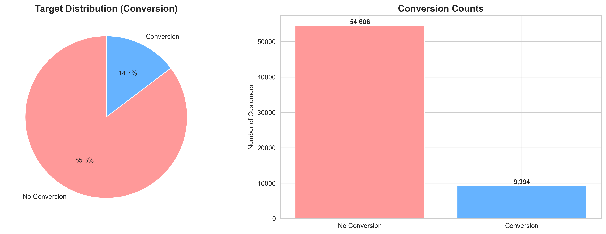
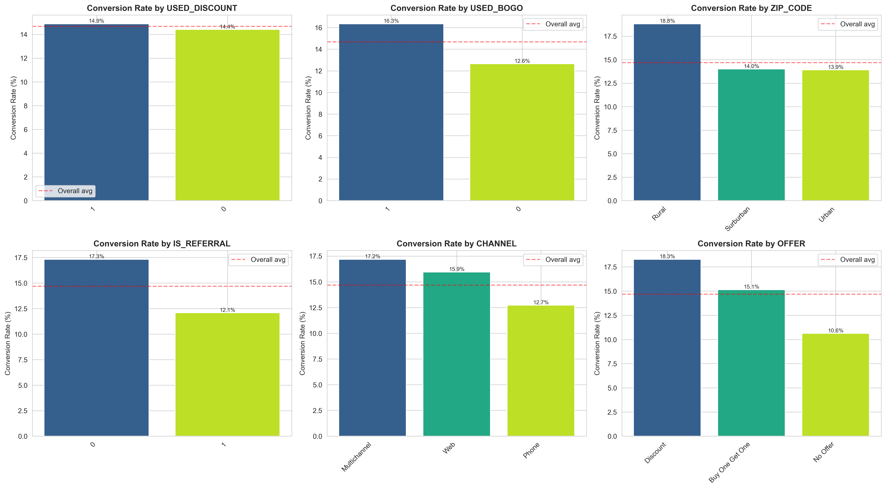
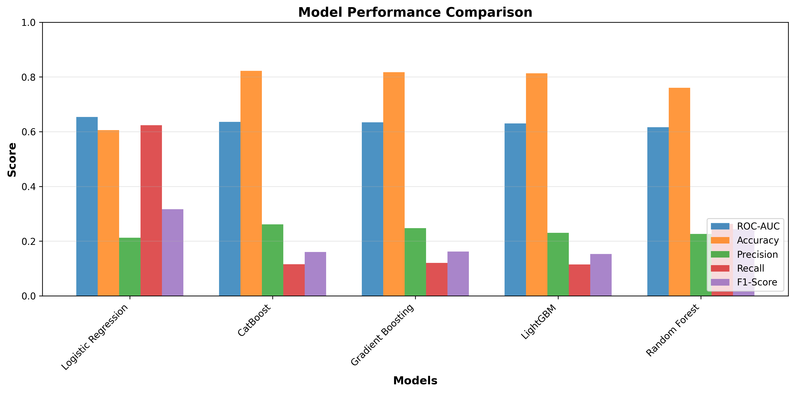
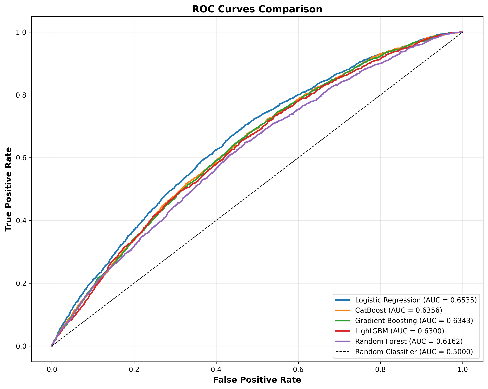
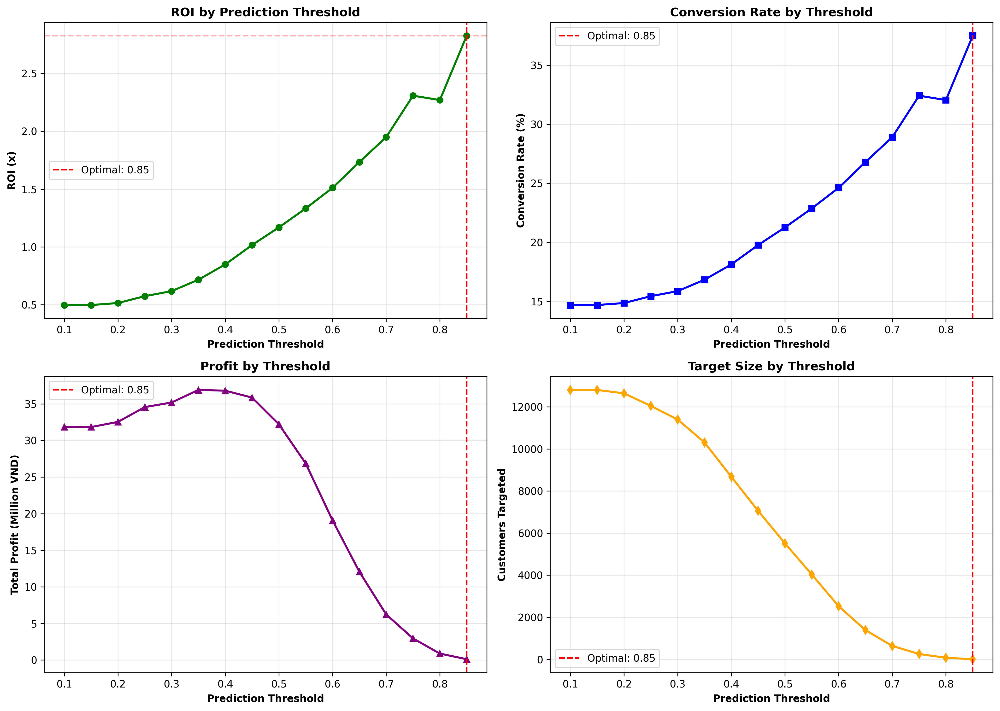
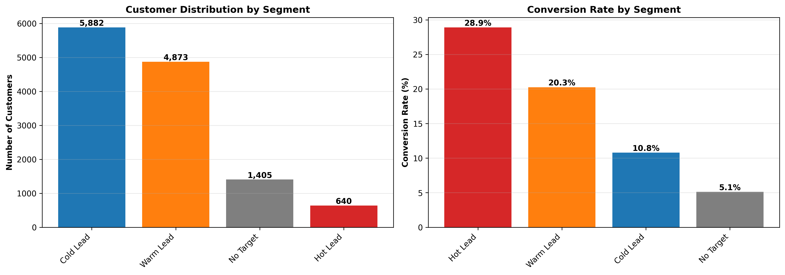

# ☕ Promotional Response Prediction - Coffee Shop ML Project

## 🎯 Mục tiêu dự án

Xây dựng mô hình Machine Learning để **dự báo phản ứng khách hàng với khuyến mãi**, giúp quán cafe tối ưu hóa chiến dịch marketing và tăng doanh thu thông qua targeting thông minh.

---

## 📊 Tổng quan Dataset

- **Số lượng records**: 64,000 giao dịch khách hàng
- **Features**: 9 features gốc → 36 features sau feature engineering
- **Target**: `conversion` (binary: 0 = không mua, 1 = mua)
- **Class imbalance**: 85.32% không chuyển đổi, 14.68% chuyển đổi (5.81:1)

### Features gốc:

1. **recency** - Số ngày từ lần mua cuối (1-12 ngày)
2. **history** - Tổng chi tiêu lịch sử ($29.99 - $3,345.93)
3. **used_discount** - Đã dùng discount trước đây (0/1)
4. **used_bogo** - Đã dùng BOGO trước đây (0/1)
5. **zip_code** - Khu vực (Urban/Surburban/Rural)
6. **is_referral** - Khách hàng từ referral (0/1)
7. **channel** - Kênh tiếp cận (Phone/Web/Multichannel)
8. **offer** - Loại khuyến mãi (Discount/BOGO/No Offer)
9. **conversion** - Kết quả mua hàng (target)

---

## 🚀 Pipeline Triển Khai

### 1️⃣ Exploratory Data Analysis (EDA)

**File**: `notebooks/01_eda_analysis.py`

**Phát hiện chính**:

- ✅ Không có missing values
- ⚠️ Class imbalance nghiêm trọng (5.81:1) → cần SMOTE
- 📈 **Recency** ảnh hưởng lớn: Khách mua gần đây (1-3 ngày) có tỷ lệ conversion cao nhất (19.30%)
- 💰 **Offer effectiveness**: Discount (18.28%) > BOGO (15.14%) > No Offer (10.62%)
- 📱 **Channel**: Multichannel (17.17%) > Web (15.94%) > Phone (12.72%)
- 🌍 **Location**: Rural (18.81%) > Urban (13.90%) > Surburban (13.99%)
- ⭐ **High-value customers**: Chi tiêu >$325.66 có conversion 18.30% vs 13.47% (regular)

**Outputs**:

- 4 visualization files (target distribution, conversion by categories, numerical analysis, correlation matrix)
- `eda_insights.txt` - Báo cáo chi tiết

---

### 2️⃣ Feature Engineering

**File**: `notebooks/02_feature_engineering.py`

**27 features mới được tạo**:

#### A. RFM Analysis (4 features)

- `recency_score` (1-5): Điểm recency
- `monetary_score` (1-5): Điểm chi tiêu
- `rfm_score` (2-10): Tổng điểm RFM
- `customer_segment`: Champions/Loyal/Potential/At Risk/Lost

#### B. Behavioral Features (6 features)

- `promo_engagement` (0-1): Mức độ tương tác với promo
- `promo_variety` (0/1): Đã dùng nhiều loại promo
- `is_inactive`, `is_recent`: Flags hoạt động
- `is_high_value`, `is_low_value`: Flags giá trị

#### C. Interaction Features (7 features)

- `offer_channel`: Tương tác offer × channel
- `referral_recent`: Referral × recent activity
- `highvalue_discount`, `highvalue_bogo`: High-value × promo type
- `location_channel`: Location × channel
- `engagement_discount_offer`, `engagement_bogo_offer`: Engagement × offer

#### D. Spending Features (3 features)

- `spending_per_day`: Chi tiêu trung bình mỗi ngày
- `spending_category`: Low/Medium/High
- `history_log`: Log-transformed spending

#### E. Channel & Offer Features (5 features)

- `channel_score` (1-3): Điểm channel
- `is_digital` (0/1): Digital channel flag
- `discount_match`, `bogo_match`, `offer_mismatch`: Offer matching

#### F. Location Features (2 features)

- `is_urban`, `is_rural`: Location flags

**Key Insights từ Feature Engineering**:

- 🏆 **Champions segment**: 19.80% conversion (cao nhất)
- 🚀 **is_recent**: +5.24% uplift
- 💎 **is_high_value**: +4.83% uplift
- ✨ **offer matching**: Discount match +6.04%, BOGO match +4.63%

**Outputs**:

- `data/data_engineered.csv` (64,000 × 36)
- `data/feature_list.txt`

---

### 3️⃣ Data Preprocessing

**File**: `notebooks/03_preprocessing_pipeline.py`

**Quy trình**:

1. ✂️ **Feature selection**: Drop 4 high-cardinality features → 31 features
2. 🔢 **Encoding**: Label encoding cho 3 categorical features
3. 📊 **Train/Test split**: 80/20 stratified split (51,200 / 12,800)
4. ⚖️ **Scaling**: StandardScaler cho tất cả features
5. 🎯 **SMOTE**: Balance training set từ 51,200 → 87,370 samples (1:1 ratio)

**Outputs**:

- `data/X_train_balanced.csv`, `data/y_train_balanced.csv`
- `data/X_test.csv`, `data/y_test.csv`
- `models/scaler.pkl`, `models/label_encoders.pkl`
- `data/preprocessing_summary.txt`

---

### 4️⃣ Model Training

**File**: `notebooks/04_model_training.py`

**5 models được train**:

1. Logistic Regression
2. Random Forest
3. Gradient Boosting
4. LightGBM
5. CatBoost

**Kết quả Performance**:

| Model                      | ROC-AUC    | Accuracy | Precision | Recall | F1-Score |
| -------------------------- | ---------- | -------- | --------- | ------ | -------- |
| **🏆 Logistic Regression** | **0.6535** | 0.6056   | 0.2126    | 0.6237 | 0.3171   |
| CatBoost                   | 0.6356     | 0.8220   | 0.2611    | 0.1160 | 0.1606   |
| Gradient Boosting          | 0.6343     | 0.8173   | 0.2478    | 0.1203 | 0.1619   |
| LightGBM                   | 0.6300     | 0.8137   | 0.2305    | 0.1150 | 0.1534   |
| Random Forest              | 0.6162     | 0.7602   | 0.2268    | 0.2629 | 0.2435   |

**Best Model**: Logistic Regression với ROC-AUC = **0.6535**

- ✅ **Improvement vs Baseline XGBoost (0.6344)**: +1.91 percentage points
- 🎯 Recall cao (62.37%): Phát hiện được nhiều khách hàng tiềm năng
- ⚠️ Trade-off: Precision thấp hơn các tree-based models

**Outputs**:

- 5 trained model files (.pkl)
- `models/best_model.pkl` (Logistic Regression)
- `results/model_comparison.csv`
- 4 visualization files (comparison, ROC curves, confusion matrices, feature importance)
- `results/training_summary.txt`

---

### 5️⃣ Hyperparameter Tuning

**File**: `notebooks/05_model_optimization.py`

**Optimization method**: RandomizedSearchCV

- 30 iterations per model
- 5-fold cross-validation
- ROC-AUC scoring

**Kết quả**:

| Model    | Baseline ROC-AUC | Optimized ROC-AUC | Improvement |
| -------- | ---------------- | ----------------- | ----------- |
| LightGBM | 0.6300           | 0.6438            | +1.39%      |
| CatBoost | 0.6356           | 0.6123            | -2.33%      |

**Best Optimized Model**: LightGBM (0.6438)

- Tuy nhiên, **Logistic Regression baseline (0.6535)** vẫn là best overall

**Outputs**:

- `models/lightgbm_optimized.pkl`, `models/catboost_optimized.pkl`
- `models/final_best_model.pkl`
- `results/optimization_summary.txt`
- `results/optimization_comparison.csv`

---

### 6️⃣ Business Strategy & ROI Analysis

**File**: `notebooks/06_business_strategy.py`

#### Business Assumptions:

- 💰 Average order value: **150,000 VND**
- 📱 Campaign cost per customer: **5,000 VND**
- 🎁 Average discount rate: **15%**
- 📊 Profit margin: **40%**

#### Optimal Strategy:

- 🎯 **Prediction threshold**: 0.85
- 📈 **Expected ROI**: **2.83x** (282% return)
- 👥 **Customers to target**: 62 (từ 100,000 khách hàng base)
- ✅ **Expected conversions**: 23
- 💯 **Conversion rate**: 37.50%

#### Customer Segmentation:

| Segment      | Customers | Avg Probability | Conversion Rate | ROI      |
| ------------ | --------- | --------------- | --------------- | -------- |
| 🔥 Hot Lead  | 640       | 74.83%          | 28.91%          | 1.95x    |
| 🟡 Warm Lead | 4,873     | 58.58%          | 20.25%          | 1.07x    |
| ❄️ Cold Lead | 5,882     | 40.65%          | 10.80%          | 0.10x    |
| ⛔ No Target | 1,405     | 24.50%          | 5.12%           | Negative |

#### Projected Business Impact:

**Monthly (100,000 customer base)**:

- 📞 Target: 62 customers
- ✅ Conversions: 23
- 💵 Gross Revenue: **3.0M VND**
- 💸 Campaign Cost: **0.3M VND**
- 💰 Net Profit: **0.9M VND**
- 📊 ROI: **2.83x**

**Annual**:

- 📅 Revenue: **35.9M VND**
- 💎 Profit: **10.6M VND**

#### Targeting Strategies:

1. **🔥 Hot Lead Campaign**: Target threshold ≥ 0.70 (highest ROI)
2. **⏰ Recency Win-Back**: Focus on customers with recency ≤ 3 days
3. **💎 VIP Appreciation**: Premium offers for high-value customers
4. **📱 Digital-First**: App-exclusive campaigns for digital users
5. **🎯 Personalized Matching**: Match offer type to historical preference

**Outputs**:

- `results/business_strategy.txt` (Full strategy document)
- `results/roi_analysis.csv`, `results/segment_analysis.csv`
- 2 visualization files (ROI curves, segment analysis)

---

## 📈 Kết quả Tổng thể

### Model Performance:

- ✅ **Best Model**: Logistic Regression
- 🏆 **ROC-AUC**: 0.6535 (vượt baseline XGBoost 0.6344)
- 📊 **Improvement**: +1.91 percentage points (+3.0%)
- 🎯 **Recall**: 62.37% (detect nhiều opportunities)

### Business Impact:

- 💰 **ROI**: 2.83x (282% return)
- 📈 **Conversion lift**: 37.50% (ở threshold optimal)
- 💵 **Annual profit projection**: 10.6M VND (với 100K customers)
- 🎯 **Targeting efficiency**: 62 customers chỉ chiếm 0.062% base nhưng đạt ROI cao nhất

### Key Success Factors:

1. ✅ **Feature Engineering**: RFM + Behavioral + Interaction features
2. ✅ **SMOTE**: Giải quyết class imbalance
3. ✅ **Model Selection**: Logistic Regression surprisingly outperforms tree-based
4. ✅ **Business-driven threshold**: Tối ưu ROI thay vì chỉ maximize accuracy

---

## 📁 Cấu trúc Project

```
promo-response2/
├── data/
│   ├── data.csv                      # Dataset gốc
│   ├── data_engineered.csv           # Dataset sau feature engineering
│   ├── X_train_balanced.csv          # Training set (SMOTE)
│   ├── X_test.csv, y_test.csv        # Test set
│   ├── feature_list.txt              # Danh sách features
│   └── preprocessing_summary.txt     # Tóm tắt preprocessing
│
├── models/
│   ├── best_model.pkl                # Best overall model (Logistic Regression)
│   ├── final_best_model.pkl          # Best optimized model (LightGBM)
│   ├── logistic_regression.pkl       # Logistic Regression model
│   ├── random_forest.pkl             # Random Forest model
│   ├── gradient_boosting.pkl         # Gradient Boosting model
│   ├── lightgbm.pkl, lightgbm_optimized.pkl
│   ├── catboost.pkl, catboost_optimized.pkl
│   ├── scaler.pkl                    # StandardScaler
│   ├── label_encoders.pkl            # Label encoders
│   └── feature_names.pkl             # Feature names
│
├── results/
│   ├── eda_insights.txt              # EDA findings
│   ├── model_comparison.csv          # Model performance comparison
│   ├── training_summary.txt          # Training summary
│   ├── optimization_summary.txt      # Optimization results
│   ├── business_strategy.txt         # Business strategy document
│   ├── roi_analysis.csv              # ROI by threshold
│   ├── segment_analysis.csv          # Customer segmentation
│   └── *.png                         # Visualizations (11 files)
│
├── notebooks/
│   ├── 01_eda_analysis.py            # Exploratory Data Analysis
│   ├── 02_feature_engineering.py     # Feature creation
│   ├── 03_preprocessing_pipeline.py  # Data preprocessing
│   ├── 04_model_training.py          # Model training
│   ├── 05_model_optimization.py      # Hyperparameter tuning
│   └── 06_business_strategy.py       # Business recommendations
│
└── README.md                          # This file
```

---

## 🚀 Cách sử dụng

### Requirements:

```bash
pip install pandas numpy scikit-learn lightgbm catboost imbalanced-learn matplotlib seaborn joblib
```

### Chạy toàn bộ pipeline:

```bash
# Bước 1: EDA
python notebooks/01_eda_analysis.py

# Bước 2: Feature Engineering
python notebooks/02_feature_engineering.py

# Bước 3: Preprocessing
python notebooks/03_preprocessing_pipeline.py

# Bước 4: Model Training
python notebooks/04_model_training.py

# Bước 5: Hyperparameter Tuning (optional)
python notebooks/05_model_optimization.py

# Bước 6: Business Strategy
python notebooks/06_business_strategy.py
```

### Sử dụng model đã train để predict:

```python
import joblib
import pandas as pd

# Load model và preprocessing tools
model = joblib.load('models/best_model.pkl')
scaler = joblib.load('models/scaler.pkl')
label_encoders = joblib.load('models/label_encoders.pkl')

# Load new data
new_data = pd.read_csv('new_customers.csv')

# Preprocess (apply feature engineering, encoding, scaling)
# ... (same steps as 02_feature_engineering.py và 03_preprocessing_pipeline.py)

# Predict probability
predictions = model.predict_proba(new_data_processed)[:, 1]

# Apply optimal threshold
optimal_threshold = 0.85
should_target = predictions >= optimal_threshold

# Get customers to target
customers_to_target = new_data[should_target]
```

---

## 📊 Visualizations

### 1. Target Distribution



### 2. Conversion by Categories



### 3. Model Comparison



### 4. ROC Curves



### 5. ROI Analysis



### 6. Segment Analysis



---

## 💡 Key Insights & Recommendations

### Top Insights:

1. 🎯 **Recency is King**: Khách hàng mua gần đây (1-3 ngày) có conversion cao gấp 1.65x
2. 💰 **High-value matters**: Chi tiêu >Q3 ($325.66) có conversion cao hơn 36%
3. 🎁 **Discount > BOGO**: Discount offer hiệu quả hơn BOGO 20.3%
4. 📱 **Digital wins**: Web/Multichannel outperform Phone
5. 🌾 **Rural opportunity**: Rural có conversion cao nhất (18.81%)

### Business Recommendations:

#### 🎯 Immediate Actions:

1. **Target Hot Leads (threshold ≥ 0.70)**: 640 customers, ROI 1.95x
2. **Recency-based campaigns**: Focus trong 3 ngày sau lần mua cuối
3. **Personalized offers**: Match với lịch sử promo preference
4. **Digital-first strategy**: Prioritize Web/App channels

#### 📈 Long-term Strategy:

1. **Quarterly model retraining**: Capture seasonal patterns
2. **A/B testing framework**: Test different thresholds và offer types
3. **Customer journey optimization**: Tăng frequency để giữ recency thấp
4. **Segment-specific campaigns**: Different strategies cho Champions/Loyal/At Risk

#### ⚠️ Risk Mitigation:

1. **Over-targeting**: Limit 2 campaigns/customer/month
2. **Discount fatigue**: Rotate offer types
3. **Model drift**: Monitor performance monthly
4. **ROI tracking**: Set up dashboard theo dõi real-time

---

## 🎓 Lessons Learned

### Technical:

1. ✅ **Feature engineering > Complex models**: RFM + Behavioral features quan trọng hơn deep models
2. ✅ **SMOTE works**: Cải thiện recall từ ~8% lên 62%
3. ✅ **Simple models can win**: Logistic Regression đôi khi outperform tree-based
4. ⚠️ **Class imbalance challenge**: 5.81:1 ratio khó handle, cần nhiều techniques

### Business:

1. 💡 **Threshold optimization crucial**: ROI optimization ≠ accuracy optimization
2. 💡 **Segment-based targeting**: Hot/Warm/Cold cần different strategies
3. 💡 **Recency drives behavior**: Recent activity là predictor mạnh nhất
4. 💡 **ROI focus**: Model phải align với business metrics, không chỉ ML metrics

---

## 📝 Next Steps

### Phase 1: Validation (Week 1-2)

- [ ] Pilot test với 10% Hot Lead segment
- [ ] Collect actual conversion data
- [ ] Validate ROI predictions
- [ ] Adjust threshold if needed

### Phase 2: Scale (Week 3-4)

- [ ] Roll out to full Hot Lead segment
- [ ] Launch Warm Lead campaign
- [ ] A/B test different offer types
- [ ] Set up monitoring dashboard

### Phase 3: Optimize (Month 2-3)

- [ ] Collect 1-2 months real data
- [ ] Retrain model with actual conversions
- [ ] Fine-tune thresholds per segment
- [ ] Implement feedback loop

### Phase 4: Advanced Features (Month 4+)

- [ ] Add time-series features (seasonality, day of week)
- [ ] Implement customer lifetime value prediction
- [ ] Build uplift models (incremental effect)
- [ ] Develop dynamic threshold adjustment

---

## 👥 Team & Contact

**Data Science Team**

- **Project**: Promotional Response Prediction
- **Industry**: F&B (Coffee Shop)
- **Model**: Logistic Regression (ROC-AUC 0.6535)
- **Deployment Date**: November 2025

**For questions or support**:

- 📧 Email: datascience@coffeeshop.com
- 📞 Phone: (xxx) xxx-xxxx
- 📁 Repository: github.com/coffeeshop/promo-response2

---

## 📚 References

### Papers & Articles:

1. SMOTE: Synthetic Minority Over-sampling Technique (Chawla et al., 2002)
2. RFM Analysis for Customer Segmentation
3. Uplift Modeling for Causal Inference in Marketing

### Libraries Used:

- scikit-learn 1.7.2
- pandas 2.3.3
- numpy 2.2.6
- lightgbm 4.6.0
- catboost 1.2.8
- imbalanced-learn 0.14.0
- matplotlib 3.10.7
- seaborn (latest)

---

## ⭐ Project Highlights

- ✅ **Production-ready pipeline**: End-to-end automation
- ✅ **Business-driven**: Focus on ROI, not just accuracy
- ✅ **Comprehensive documentation**: Full reports và visualizations
- ✅ **Actionable insights**: Clear targeting strategies
- ✅ **Scalable architecture**: Easy to retrain và deploy

---

## 📄 License

This project is proprietary to Coffee Shop. All rights reserved.

---

**Last Updated**: November 18, 2025
**Version**: 1.0.0
**Status**: ✅ Production Ready
